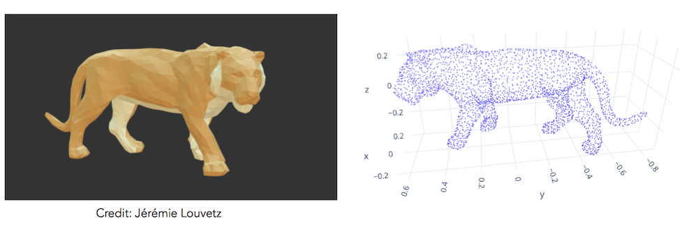
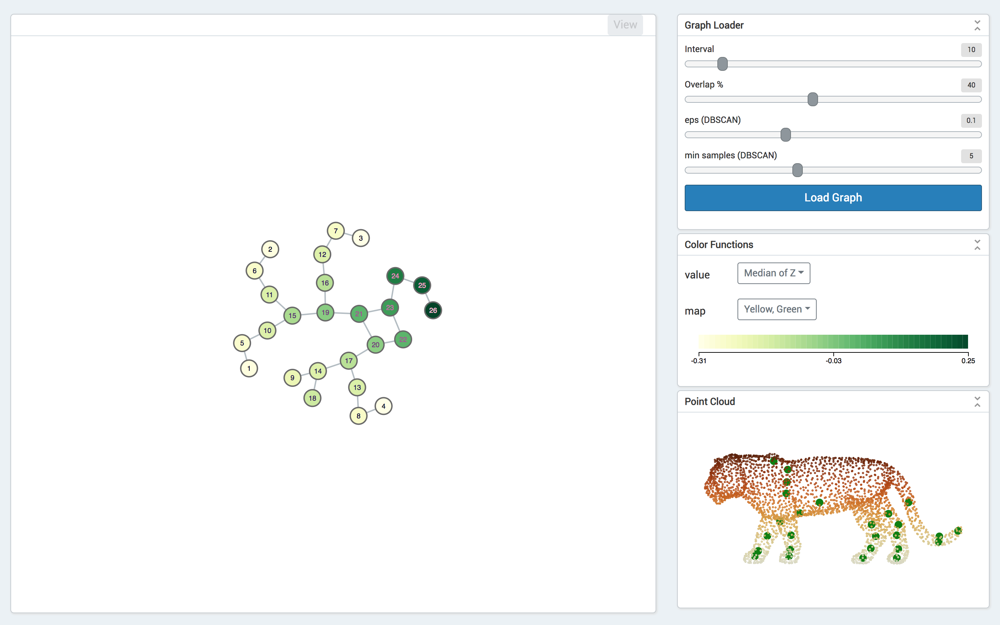

# Mapper Core Example: Kepler Mapper Backend

This is an example of Mapper Core using Kepler Mapper as backend.
[Here](https://kepler-mapper-backend.herokuapp.com) is a live demo of this repo.

## Point Cloud Data

We are using a point cloud of Sumatran Tiger for demonstration.
Please visit [plot.ly](https://plot.ly/~yaodong/96) to have a live demo.

## Screenshot

## Credits

- [KeplerMapper](https://kepler-mapper.scikit-tda.org) is a library implementing the Mapper algorithm in Python, created by Hendrik Jacob van Veen and Nathaniel Saul. 
- The original 3D model [Sumatran Tiger](https://sketchfab.com/3d-models/sumatran-tiger-95c4008c4c764c078f679d4c320e7b18) is made by [Jérémie Louvetz](https://sketchfab.com/jeremielouvetz).
- The 3D render for D3.js is made by [Stefan Nieke](https://bl.ocks.org/Niekes/d8007a5f71f45ab80a2977a8eb7ab3c9).
